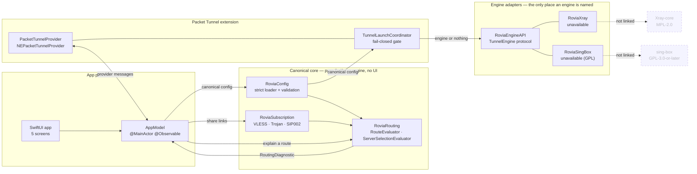

<div align="center">

# Rovia

**Explainable routing for a privacy-first network client.**

An open-source, engine-independent core for Apple platforms — built so that a routing
decision can be *shown*, not just applied.

[](#status--what-works-and-what-does-not)
[](https://github.com/princeofscale/rovia/actions/workflows/ci.yml)
[](https://github.com/princeofscale/rovia/actions/workflows/engine-repro.yml)
[](LICENSE)
[](engines.lock.json)
[](docs/development/ios.md)

</div>

---

> [!IMPORTANT]
> **This build does not establish a VPN tunnel, and no VPN claim is made here.**
> There is no production engine in this repository: `engines.lock.json` enables none,
> the Packet Tunnel extension therefore refuses to start before it touches any network
> setting, and there is no `packetFlow` → Xray bridge. The part of Rovia that *is*
> finished is the domain core and the fail-closed scaffolding around it. Read
> [Status](#status--what-works-and-what-does-not) before anything else.

---

## What is Rovia?

Rovia is a pre-alpha, iOS-first, privacy-first open-source network client built around
an **engine-independent canonical core**.

Most clients in this space hand you a subscription and a toggle. Rovia's premise is
that a routing decision should be inspectable: which rule matched, why that rule was
chosen, which servers were eligible, and why one was picked over another. The
diagnostic that answers those questions is part of the domain model, not a debug
screen bolted on afterwards.

Everything above the engine — configuration, subscription parsing, routing, health-aware
selection — is Swift, has no engine dependency, and is covered by tests that need no
network and no device.

### The architectural idea in one diagram



The dashed boxes are the point. Xray and sing-box are **not present in this
repository** and must never reach the canonical model, the diagnostic, or the UI. An
engine's own JSON dialect stays inside its adapter; everything above the adapter sees
one canonical vocabulary. `tools/ci/test_app_dependencies.py` enforces this as a
mutation gate: 9 mutations that break the Xcode wiring, 16 that smuggle a second route
evaluator into the app, and 20 that persist a raw routing trace.

## Status — what works and what does not

| | |
|---|---|
| **State** | `Pre-alpha`. No release, no tag, no App Store submission. |
| **Establishes a VPN tunnel** | **No.** No production engine is enabled. |
| **Xray `packetFlow` bridge** | **Not implemented.** Adapters are typed stubs. |
| **Signed device / archive validation** | **Has not happened.** No Apple Developer team, no certificate, no provisioning profile. |
| **Hosted CI** | Runs on every push and pull request. See [Verification](#verification). |
| **Android** | Not started. |

### ✅ Verified — implemented and tested

- Strict canonical configuration: version 1 only, unknown and future versions
  rejected, duplicate/reference/range/port/secret validation, JSON Schema ⇄ Codable
  parity, and negative fixtures that fail the validator when a constraint stops
  mattering.
- Bounded share-link parsing for VLESS, Trojan and Shadowsocks SIP002: 1 MiB input
  cap, strict URI/query/host/port rules, secret sink, and diagnostics that cannot
  contain a raw credential.
- A pure routing evaluator: `RouteEvaluator.explain` returns a redacted
  `RoutingDiagnostic` with stable, role-specific reason codes. No I/O, no clock, no
  randomness.
- A pure health-aware selector: manual choice, lowest latency, and failover, with
  stale-sample handling, deterministic tie-breaking, and an explicit no-candidate
  result.
- A SwiftUI app with a `NavigationSplitView`, five semantic screens, an idempotent
  bootstrap, duplicate-action suppression, and a fail-closed tunnel start: when no
  engine is available the extension returns a typed `engineUnavailable` **before**
  `setTunnelNetworkSettings`.
- A fail-closed release and provenance pipeline: engine-lock verification, SPDX 2.3
  SBOM generation with byte-reproducibility, provenance manifests, tag grammar, and
  a signing-identity preflight that refuses to run on an unresolved Apple team ID.

### ❌ Not verified — cannot be claimed

- **A working tunnel.** There is no engine, so the VPN path has never run end to end.
  The 60 app tests are a launch and model check, not a tunnel.
- **Packet Tunnel Provider lifecycle on a device.** Only a simulator install/launch
  was performed. A process staying alive in the simulator is evidence about a process
  starting.
- **A signed artifact.** No certificate, no profile, no `xcodebuild archive`, no export.
  The build is genuinely unsigned — `codesign` reports *not signed at all*.
- **Dual-stack behaviour, IPv6, reconnect, failover under real loss.** Untested;
  there is no link to lose.
- **Apple App Review acceptance.** Never submitted.

### 🔒 Blocked by prerequisites outside this repository

Ten gates, each naming the artefact that would close it, are tracked in
[`docs/development/release-readiness.md`](docs/development/release-readiness.md).
The two that gate everything else: **no Apple Developer team** and **no production
engine**.

## The app


<sub>
A real screenshot of the current build, taken on an iPad simulator. It is the Overview
screen of the app in this repository, running over the app's built-in sample data —
there is no mock here and no real provider. It is also the clearest single statement of
this project's current state: the engine is reported unavailable, **Connect is
disabled**, and the screen says so in its own subtitle. Nothing in the UI pretends a
tunnel exists.
</sub>

## Privacy-first principles

These are design constraints with tests behind them, not aspirations.

- **No telemetry, no analytics, no advertising SDK.** The identifier `telemetryEnabled`
  exists only as a schema constant pinned to `false` and a validator that *rejects* a
  document which sets it true. There is no `URLSession`, `URLRequest` or `NWConnection`
  anywhere in the source.
- **No packet payload or browsing-history logging.** Raw routing traces
  (`RoutingDecisionTrace`, `RuleEvaluation`) are deliberately **not `Codable`**, so they
  cannot be encoded into a diagnostic, a log line, a provider message, or a file. The
  gate that holds this scans `core/`, `client/`, `platform/` and `engines/` for nine
  separate leak channels.
- **Secret references, not credentials.** Persisted configuration holds a
  `SecretReference`; the value travels through a transient sink and is never written to
  a model, a diagnostic, or an error message.
- **Public APIs only on Apple platforms.** `NEPacketTunnelProvider` and
  `NEPacketTunnelFlow.packetFlow`. No raw `utun` file descriptor, no private API, no
  `ioctl`. The prohibition is also written into the ADRs so a future contributor meets
  it before writing the code.
- **No post-install executable engine.** A build does not download code. The release
  gate refuses an engine lock that has no pinned commit and artifact digest.
- **A LAN HTTP server is not a control channel.** Host and extension talk over a
  versioned, size-limited, schema-validated provider message.

[`PRIVACY.md`](PRIVACY.md) is the authoritative statement — including where redaction
can fail, and the mapping from each claim to the App Store privacy question it answers.
[`SECURITY.md`](SECURITY.md) covers vulnerability reporting and the security model.

## Repository structure

| Path | What lives there |
| --- | --- |
| `core/config` | Canonical models, strict loader, validation rules. No UI, no engine. |
| `core/subscription` | Share-link parser, redaction, sanitisation. |
| `core/routing` | Route evaluator, routing diagnostic, server selection. |
| `engines/api` | The `TunnelEngine` protocol — the only engine-shaped thing in the tree. |
| `engines/xray`, `engines/singbox` | Adapter boundaries. Both currently unavailable. |
| `platform/apple` | Tunnel launch coordination, Keychain and App Group stores. |
| `client/app/ios` | SwiftUI app and the Packet Tunnel extension. |
| `schemas` | Portable JSON contracts, shared with any future Android client. |
| `fixtures` | Sanitised test vectors. Every host is `synthetic.example`. |
| `tools/ci` | Every gate. Local and hosted CI run the same commands. |
| `tools/reproducibility` | SBOM generation and checking, provenance manifests. |
| `tools/release`, `tools/build-engine` | Tag grammar, export-options preflight, engine build refusal. |
| `docs/adr` | The decisions, and why each was taken. |
| `docs/architecture` | Overview, decision log, and the next spikes. |
| `docs/development` | CI reference, iOS notes, the dated verification record, release readiness. |
| `docs/security`, `docs/legal` | Threat model, engine-licensing constraints, App Store notes. |

## Importable protocols

A share link or a pasted subscription is the only import path. All parsing is
`core/subscription` and all of it is bounded and redacted.

| Scheme | Status | Notes |
| --- | --- | --- |
| `vless://` | Implemented | UUID or non-standard id, TLS and WebSocket transports, host/SNI/header parameters. |
| `trojan://` | Implemented | Password, SNI, and transport options. |
| `ss://` SIP002 | Implemented | `user:pass@host:port` and base64 forms, AEAD methods, Shadowsocks 2022 blobs. |
| `vmess://` | Rejected | Deliberately unimplemented. Named here so the boundary is visible. |
| `ssr://` | Rejected | Deliberately unimplemented. |
| `http(s)://` subscription list | Not implemented | Planned after the engine boundary is closed. |

Rejection is explicit and tested: a `vmess://` link is a typed refusal, not a silent
drop, and the error contains no fragment of the input.

## Routing architecture

`RouteEvaluator.explain(candidate, config)` is a pure function. It returns a
`RoutingDiagnostic`:

- the **redacted** candidate — `host: "redacted"`, never the value that was matched;
- a **stable reason code** for the outcome, chosen per decision role so a UI can react
  without string matching;
- the ordered list of rules that were evaluated and the one that decided;
- the resulting action: direct, block, proxy, or a named group.

Two deliberate design decisions:

**Redaction is applied at the model boundary, not at the display layer.** The
`RoutingDiagnostic` type cannot represent an unredacted host, so a future screen cannot
leak one by forgetting to mask a field. The property is checked by a mutation that adds
a host field and must fail.

**`ServerSelectionEvaluator` is deterministic.** Given the same samples it returns the
same answer: ties break on a documented field order, stale samples are excluded, and
"no eligible candidate" is a value rather than an empty array. It reads no clock, opens
no socket, and takes no random source — so a selection decision can be reproduced in a
test and in an audit.

## Security model

The full threat model is in [`docs/security/threat-model.md`](docs/security/threat-model.md).
The short version:

- **Credential boundary.** `core/config` holds `SecretReference` and the rules bounding
  a secret key. It is the most credential-adjacent code in the repository and the
  first path a reviewer should read.
- **Engine boundary.** The `TunnelEngine` protocol is the only surface an engine can
  touch. A canonical config crosses it in one direction; a tunnel result crosses back.
  An engine cannot name a routing rule, because it never sees one.
- **Release boundary.** A release is refused unless every input is present *and*
  mutually consistent: signing secrets, a well-formed tag, a matching artifact version,
  a matching checksum, an SBOM covering every package, and a provenance manifest whose
  hashes match the files on disk. A gate that cannot be satisfied is a stop, not a
  warning.
- **No code execution after install.** Engine artefacts are pinned by commit and
  digest, and there is no download path.
- **Publication hygiene.** `tools/ci/check-repository-hygiene.sh` refuses a tree that
  would publish a credential shape, a developer's home directory, or a build artifact.
  It runs in CI, so the claim survives the commit that makes it.

### Engine licensing

| Component | License | Position |
| --- | --- | --- |
| Rovia's own Swift, schemas, and tooling | MIT (provisional) | Provisional until the distribution model is settled. |
| Xray-core | MPL-2.0 | First production candidate. Not bundled. |
| libXray | MIT wrapper | Its own licence does not override Xray-core's obligations. |
| sing-box / Libbox | GPL-3.0-or-later | **Disabled.** A licence-sensitive area requiring its own review. |

New code is MIT-provisional, which does **not** mean every binary would be MIT. If a
build ever ships GPL-covered sing-box, the distribution model has to change and the
project needs legal review first — an official client, or a successful iOS build, is
not a licence grant.

[`docs/legal/licensing.md`](docs/legal/licensing.md) states the boundary of the grant,
[`THIRD_PARTY_NOTICES.md`](THIRD_PARTY_NOTICES.md) records each engine candidate's
status, and [ADR-0004](docs/adr/0004-engine-licensing.md) records the decision. None
of it is legal advice.

## Verification

Local and hosted CI run the same commands, so a green badge is a claim you can
reproduce:

```bash
./tools/ci/run-tool-tests.sh                 # every tool test, then three gates
for p in $(grep -v '^#' tools/ci/local-packages.txt); do
  swift test --package-path "$p"
done
python3 tools/ci/validate-schemas.py
xcodebuild -project client/app/ios/RoviaApp.xcodeproj -scheme RoviaApp \
  -destination 'platform=iOS Simulator,name=iPhone 17 Pro' test
```

<!-- counts:start -->
| Swift packages (`tools/ci/local-packages.txt`) | 7 | 160 |
| iOS app model (`RoviaAppTests`) | 1 | 60 |
| Tooling gates (`tools/**/test_*.py`) | 10 | 613 |
| **Total** | | **833** |
<!-- counts:end -->

The figures above are generated by `tools/ci/update-readme-counts.py` from the same
loaders the suite uses, and `tools/ci/test_ci_checks.py` fails if the committed text
drifts from them — a number in prose that nobody re-derives is how a record goes stale
while every test stays green. Swift counts are read from the test sources; the badge
and the run log are the evidence that they execute and pass.

## Roadmap

Milestones, in the order the dependencies actually allow. No dates.

| Milestone | What has to be true |
| --- | --- |
| **Canonical Core** | ✅ Config, subscription, routing and selection — implemented, tested, engine-free. |
| **Engine Integration** | A pinned Xray commit, a reproducible build recipe, an artifact digest, and a working `TunnelEngine` conformance test. |
| **Packet Tunnel** | The `packetFlow` ⇄ engine bridge, the IPv4/IPv6/dual-stack decision, and the tunnel lifecycle under loss. |
| **Physical Device Validation** | Real profiles, real traffic, reconnect and failover evidence, dual-stack documented. |
| **Signed Distribution** | An Apple Developer team, signing, archive, export, TestFlight, App Review notes. |
| **Beta** | The above, plus a real user's provider configuration, and an App Store privacy label that matches what the code does. |

The sing-box adapter sits deliberately **outside** the main line: it is a
licence-sensitive area, and adding it is a distribution decision before it is a
code change.

## Building and developing

Requires macOS with Xcode and Swift 6.2 or later, and Python 3.11 or later for the
tooling.

```bash
git clone https://github.com/princeofscale/rovia.git
cd rovia

# Domain packages — no simulator, no device.
swift test --package-path core/config
swift test --package-path core/routing
swift test --package-path core/subscription

# The iOS app needs Xcode. Derived data must live outside the checkout: a derived-data
# path inside the repository makes the XCTest runner time out before it runs a test,
# because the runner process is not granted access to the protected directory.
export DERIVED_DATA="${TMPDIR:-/tmp}/rovia-derived-data"
xcodebuild -project client/app/ios/RoviaApp.xcodeproj -scheme RoviaApp \
  -destination 'platform=iOS Simulator,name=iPhone 17 Pro' \
  -derivedDataPath "$DERIVED_DATA" test

# Everything else.
./tools/ci/run-tool-tests.sh
```

The app runs unsigned in a simulator, where it will show its five screens over
built-in sample data and refuse to start a tunnel. `docs/development/ios.md` has the
full commands; `docs/development/ci.md` has every gate and what each one proves.

## Contributing

Read [`CONTRIBUTING.md`](CONTRIBUTING.md) first. The short version: open an issue or an
RFC before a substantial change, keep the core free of UI and engine dependencies, use
sanitised fixtures, and expect a review to ask what a new test can fail.

Contributions are welcome, and so is a second maintainer — see
[Governance](GOVERNANCE.md).

## Security

**Do not report a vulnerability through a public issue.** Use GitHub's private
vulnerability reporting on this repository, or follow the process in
[`SECURITY.md`](SECURITY.md). A privacy leak, a redaction failure, or an unexpected
outbound request is a security report.

## License

Rovia's own code is MIT-licensed **provisionally** —
see [`LICENSE`](LICENSE). This is not a statement about the licences of anything a
future build might bundle: Xray-core is MPL-2.0, libXray is an MIT wrapper around it,
and sing-box is GPL-3.0-or-later and currently disabled. The final distribution scheme
depends on which engine integration is chosen, and that decision has not been made.

Third-party notices: [`THIRD_PARTY_NOTICES.md`](THIRD_PARTY_NOTICES.md).

## Documentation

| Document | What it answers |
| --- | --- |
| [`docs/architecture/overview.md`](docs/architecture/overview.md) | How the layers fit, and what each boundary forbids. |
| [`docs/architecture/next-spikes.md`](docs/architecture/next-spikes.md) | The next pieces of work, and the decisions each one has to settle. |
| [`docs/adr/`](docs/adr/) | Six decisions: iOS-first, canonical config, engine interface, licensing, one Go runtime, packet flow. |
| [`docs/security/threat-model.md`](docs/security/threat-model.md) | What is defended, what is not, and which controls are not implemented. |
| [`docs/legal/app-store-distribution.md`](docs/legal/app-store-distribution.md) | Distribution constraints and the pre-submission checklist. |
| [`docs/development/ci.md`](docs/development/ci.md) | Every gate, its order, and what it proves. |
| [`docs/development/foundation-verification.md`](docs/development/foundation-verification.md) | The dated verification record, with derived figures. |
| [`docs/development/release-readiness.md`](docs/development/release-readiness.md) | The ten open external gates. |
| [`docs/development/control-api.md`](docs/development/control-api.md) | The host ⇄ extension message contract. |

<p align="center">
<sub>Pre-alpha software. No tunnel, no release, no App Store presence. Built to be audited.</sub>
</p>
